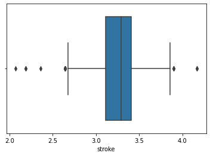

# Laporan Proyek Machine Learning

### Nama : Rifky Azhar Prayoga

### Nim : 211351124

### Kelas : IF Pagi A

## Domain Proyek

Proyek ini dapat digunakan untuk mengidentifikasi 
harga harga mobil dan juga spesifikasi spesifikasi yang ada pada mobil.

## Business Understanding

Pengecekan harga harga mobil

### Problem Statements

- Dalam kasus ini, masalah yang saya jelajahi adalah masalah klasifikasi Linear.

Saya akan mencari informasi dan memprediksi tentang harga harga mobil

### Goals

- Menemukan Klasifikasi dan infromasi harga mobil yang sesuai.

### Solution statements

- Pengembangan platform pencarian harga mobil berbasis web yang mengitegrasikan data dari kaggle.com untuk mempermudah dah mempercepat akses informasi.
- Model yang dihasilkan dari datasets itu menggunakan metode Linear Regression.

## Data Understanding

Dataset yang saya gunakan berasal dari Kaggle ..<br>

[Klasifikasi car price](https://www.kaggle.com/datasets/ashydv/car-price-prediction).

### Variabel-variabel pada Klasifikasi Penyakit Jantung adalah sebagai berikut:

- car_ID : menunjukan ID mobil. [Number,max:100, min:1]
- symboling : Masukan simbol. [Number,max:100, min:1]
- wheelbase : jarak sumbu mobil. [Number,max:100, min:1]
- carlength : Masukan panjang mobil. [Number,max:4, min:4] 
- carwidth : Masukan Tahun. [Number,max:100, min:1]
- carheight : Masukan Tinggi Mobil. [Number,max:4, min:2]
- enginesize : Masukan ukuran mesin. [Number,max:100, min:1] 
- boreratio : Masukan rasio goresan. [Number,max:100, min:1]
- stroke : Masukan akselarasi [Number,max:100, min:1]
- compressionratio : Masukan rasio kompresi [Number,max:100, min:1]
- horsepower : Masukan horsepower [Number,max:100, min:1]
- peakrpm : Masukan peakrpm [Number,max:100, min:1]

## Data Preparation
 
 
 
 
 

### Data Collection

Untuk data collection ini, saya mendapatkan dataset yang nantinya digunakan dari website kaggle dengan nama dataset Klasifikasi car price, jika anda tertarik dengan datasetnya, anda bisa click link diatas.

### Data Discovery And Profiling

Untuk bagian kolom ini kita tambahkan libary terlebih dahulu

```bash
import pandas as pd
import numpy as np
import matplotlib.pyplot as plt
import seaborn as sns
```

Karna kita pakai google coleb,kita pake script seperti yang di bawah,nanti kita tinggal upload file kaggle.json nya.

```bash
from google.colab import files
files.upload()
```

Setelah mengupload filenya, maka kita akan lanjut dengan menyimpan file kaggle.json yang sudah diupload tadi

```bash
!mkdir -p ~/.kaggle
!cp kaggle.json ~/.kaggle/
!chmod 600 ~/.kaggle/kaggle.json
!ls ~/.kaggle
```

Dan setelah itu kita download dataset terlebih dahulu.

```bash
!kaggle datasets download -d dharanireddy/heart-disease
```

Setelah download file dataset tadi kita akan Meng Extract file dataset yang telah kita download tadi

```bash
!unzip heart-disease.zip -d heart
!ls heart
```

Klik file yang telah di extract lalu salin file csv nya dengan nama Copy path atau salin jalur dan paste di bawah ini

```bash
df = pd.read_csv("/content/heart/heart.csv")
```

kita akan melihat dataset

```bash
df.head()
```

Selanjutnya kita akan memeriksa apakah datasetsnya terdapat baris yang kosong atau null dengan menggunakan seaborn

```bash
df.info()
```

```bash
df.isna().sum()
```

- ID Mobil 0
- simbol 0
- jarak sumbu mobil 0
- panjang mobil 0
- Tahun 0
- Masukan Tinggi Mobil 0
- ketahan muatan 0
- ukuran mesin 0
- rasio goresan 0
- akselarasi 0
- rasio kompresi 0
- horsepower 0
- peakrpm 0
  dtype: int64

```bash
plt.figure(figsize=(10,8))
sns.heatmap(df.corr(),annot=True)
```


```bash
df.head()
```

kita lihat lagi dataset nya apakah berubah atau tidak

```bash
df.info()
```
img


```bash
df.head()
```

kita lihat lagi dataset nya apakah berubah atau tidak

```bash
df.info()
```

### Feature

Semua kolom tidak memiliki nilai dan memiliki kolom dan tidak mengandung syntax

Feature bisa di gunakan menghitung parameter estimasi

```bash
features = ['symboling','wheelbase','carlength','carwidth','carheight','curbweight','enginesize','boreratio',' stroke','compressionratio','horsepower'
,'peakrpm','citympg']
x = df[features]
y = df['target']
x.shape, y.shape
```

```bash
x_test.shape
```

(152, 14)

# Modeling

sebelumnya mari kita import library yang nanti akan digunakan,

```bash
from sklearn.linear_model import LinearRegression
lr = LinearRegression()
lr.fit(x_train,y_train)
pred = lr.predict(x_test)
```

Lalu berikut adalah skor akurasi dari model yang kita buat

```bash
score = lr.score(x_test,y_test)
print('Akurasi model Regresi Linear', score)
```

Akurasi model Regresi Linear 1.0

```bash
print(x)
```

```bash
input_data = np.array([[63,1,3,145,233,1,0,150,0,2.3,0,0,1,1]])

prediction = lr.predict(input_data)
print('Estimasi Hasil Penyakit Jantung :',prediction)
print('Nilai Klasifikasi Penyakit Jantung adalah : 6')
```

# Evaluation

Root Mean Square Error (RMSE) adalah standar deviasi dari residu (kesalahan prediksi). Residual adalah ukuran seberapa jauh titik data dari garis regresi; RMSE adalah ukuran seberapa tersebar residu ini. Dengan kata lain, ini memberi tahu Anda seberapa terkonsentrasi data di sekitar garis yang paling sesuai. Root mean square error biasanya digunakan dalam klimatologi, peramalan, dan analisis regresi untuk memverifikasi hasil eksperimen

```bash
from sklearn.metrics import r2_score
from sklearn.metrics import mean_squared_error

print('R2:', r2_score(y_test,pred))
print('RMSE:', np.sqrt(mean_squared_error(y_test, pred)))
```

# Deployment

[Estimasi Klasifikasi car price](https://app-carprice-exuxvqgxndx4twwuwgh5y5.streamlit.app/)

